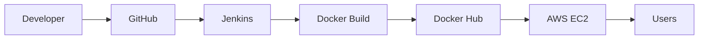

<!-- ================= HEADER ================= -->

  

  

<h3 align="center">🚀 Open to Junior DevOps Engineer • Cloud Engineer • Platform Engineer Roles</h3>

<a href="https://jacksamson1503.github.io/DevOps_Portfolio/">🌐 Portfolio</a> •
<a href="https://www.linkedin.com/in/jacksamson-devops/">LinkedIn</a>

---

# 👨‍💻 About Me

I'm a passionate **Junior DevOps & Cloud Engineer** with hands-on experience building CI/CD pipelines, deploying applications on AWS, automating infrastructure with Terraform, and working with Docker, Jenkins, Linux, and Kubernetes.

- ☁️ AWS Cloud
- 🐳 Docker
- ☸ Kubernetes
- ⚙️ Jenkins
- 🏗 Terraform
- 🐧 Linux
- 📈 Prometheus & Grafana

---

# 🚀 DevOps Workflow

---

# ⚡ Tech Stack

---

# 📚 Skills

| Category | Technologies |
|-----------|--------------|
| Cloud | AWS |
| Containers | Docker |
| Orchestration | Kubernetes |
| IaC | Terraform |
| CI/CD | Jenkins |
| Monitoring | Prometheus, Grafana |
| SCM | Git, GitHub |
| OS | Linux |
| Scripting | Bash, Python |

---

# 🔥 Featured Projects

## 🚀 CI/CD Login Portal with Jenkins on AWS
- Jenkins Pipeline
- Docker
- AWS EC2
- GitHub
- Automated Deployment

🔗 https://github.com/jacksamson1503/CI-CD-Login-Portal-with-Jenkins-on-AWS

---

## 📊 Prometheus & Grafana Monitoring
- Prometheus
- Grafana
- EC2 Monitoring

🔗 https://github.com/jacksamson1503/Prometheus-Grafana-Monitoring-on-AWS-EC2

---

## ☁️ AWS Auto Scaling

🔗 https://github.com/jacksamson1503/AWS_Auto-Scaling

---

## ⚖ AWS Load Balancer

🔗 https://github.com/jacksamson1503/Jack_AWS_Loadbalancer

---

## 🏗 Terraform Static Website

🔗 https://github.com/jacksamson1503/terraform-aws-s3-static-website

---

# 🌱 Currently Learning

- Advanced Kubernetes
- Amazon EKS
- Helm
- GitHub Actions
- Argo CD

---

# 📜 Certifications

- Cloud Computing
- Linux Administration
- DevOps Fundamentals

---

# 📈 GitHub Statistics

---

# 📫 Connect With Me

---

⭐ If you like my projects, don't forget to star them!

