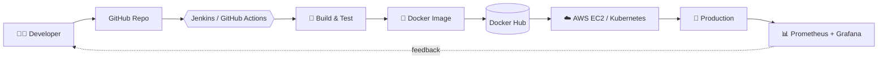

<!-- HEADER BANNER -->
<div align="center">


<br>

<a href="https://jacksamson1503.github.io/DevOps_Portfolio/"></a>
<a href="https://www.linkedin.com/in/jacksamson-devops/"></a>
<a href="https://github.com/jacksamson1503"></a>


</div>

---

## 👨‍💻 About Me

I'm a **Junior DevOps & Cloud Engineer** who loves turning manual, error-prone work into **automated, repeatable, observable systems**. I design CI/CD pipelines, provision cloud infrastructure with Terraform, containerize applications, and monitor everything that runs in production.

```yaml
name: Jack Samson
role: Junior DevOps & Cloud Engineer
focus: [CI/CD, Infrastructure as Code, Containers, Monitoring]
cloud: AWS
currently_learning: [Amazon EKS, Helm, Argo CD, GitHub Actions]
open_to_work: true
philosophy: "If you do it twice, automate it."
```

| 🎯 Focus | 🛠 What I Do |
|---|---|
| ☁️ **Cloud** | Design scalable, highly available AWS infrastructure (EC2, ALB, Auto Scaling, S3) |
| ⚙️ **CI/CD** | Build end-to-end pipelines with Jenkins and GitHub Actions |
| 🏗 **IaC** | Provision reproducible environments using Terraform |
| 🐳 **Containers** | Dockerize apps and orchestrate them on Kubernetes |
| 📊 **Observability** | Monitor systems with Prometheus & Grafana dashboards |
| 🐧 **Linux** | Administer, secure, and script Linux-based servers |

---

## 🧰 Tech Stack

<div align="center">

**Cloud & Infrastructure**<br>


**Containers & Orchestration**<br>


**CI/CD & Version Control**<br>


**Monitoring & Scripting**<br>


</div>

---

## 🔄 How I Ship Software


```mermaid
flowchart LR
    A[👨‍💻 Developer] --> B[GitHub Repo]
    B --> C{{Jenkins / GitHub Actions}}
    C --> D[🧪 Build & Test]
    D --> E[🐳 Docker Image]
    E --> F[(Docker Hub)]
    F --> G[☁️ AWS EC2 / Kubernetes]
    G --> H[🚀 Production]
    H --> I[📊 Prometheus + Grafana]
    I -.feedback.-> A
```

---

## 🚀 Featured Projects

<table>
<tr>
<td width="50%" valign="top">

### 🔐 CI/CD Login Portal on AWS
`Jenkins` `Docker` `GitHub` `AWS EC2` `Linux`

Fully automated build → containerize → deploy pipeline triggered on every push.

- Dockerized web application
- End-to-end CI/CD on EC2
- Zero manual deployment steps

[**View Project →**](https://github.com/jacksamson1503/CI-CD-Login-Portal-with-Jenkins-on-AWS)

</td>
<td width="50%" valign="top">

### 📊 Prometheus & Grafana Monitoring
`Prometheus` `Grafana` `AWS EC2`

Real-time infrastructure monitoring with custom dashboards.

- Server & resource metrics collection
- Custom Grafana dashboards
- Metrics visualization for quick troubleshooting

[**View Project →**](https://github.com/jacksamson1503/Prometheus-Grafana-Monitoring-on-AWS-EC2)

</td>
</tr>
<tr>
<td width="50%" valign="top">

### 🏗 Terraform Static Website
`Terraform` `AWS S3` `IaC`

Static website infrastructure provisioned entirely as code.

- Repeatable, version-controlled infrastructure
- One-command deploy & destroy

[**View Project →**](https://github.com/jacksamson1503/terraform-aws-s3-static-website)

</td>
<td width="50%" valign="top">

### 📈 AWS Auto Scaling
`AWS` `Auto Scaling Groups` `EC2`

Scalable infrastructure that grows and shrinks with demand.

- Launch templates & scaling policies
- Cost-efficient, resilient design

[**View Project →**](https://github.com/jacksamson1503/AWS_Auto-Scaling)

</td>
</tr>
<tr>
<td colspan="2" valign="top">

### ⚖️ AWS Application Load Balancer
`AWS` `ALB` `High Availability`

Configured highly available traffic distribution across multiple targets with health checks.

[**View Project →**](https://github.com/jacksamson1503/Jack_AWS_Loadbalancer)

</td>
</tr>
</table>

---

## 📈 Skill Proficiency

| Skill | Level |
|---|---|
| AWS |  |
| Docker |  |
| Jenkins CI/CD |  |
| Terraform |  |
| Linux |  |
| Kubernetes |  |
| Prometheus & Grafana |  |

---

---

## 📊 GitHub Analytics

<div align="center">


</div>

---


---

## 🎓 Certifications & Learning

- ☁️ Cloud Computing
- 🐧 Linux Administration
- 🔧 DevOps Fundamentals

<sub>*(Add exact certificate names + badges here, e.g. AWS Cloud Practitioner, Terraform Associate, CKA.)*</sub>

---

## 💼 Open To

| Role | Level |
|---|---|
| 🚀 DevOps Engineer | Junior / Entry |
| ☁️ Cloud Engineer | Junior / Entry |
| 🏗 Platform Engineer | Junior / Entry |
| 🛡 Site Reliability Engineer | Entry |

---

<details>
<summary><b>💡 Fun facts & how I work</b></summary>

- 🧠 I document everything — future me is my most important teammate.
- 🔁 I treat infrastructure like code: version it, review it, test it.
- 🎯 I prefer small, frequent deployments over big risky releases.
- 📚 I learn best by building — every tool on this page has a repo behind it.

</details>

---

<div align="center">

### 🤝 Let's Connect

<a href="https://www.linkedin.com/in/jacksamson-devops/"></a>
<a href="https://jacksamson1503.github.io/DevOps_Portfolio/"></a>
<a href="https://github.com/jacksamson1503"></a>

<br><br>

*"Automating today for a better tomorrow."*


</div>
